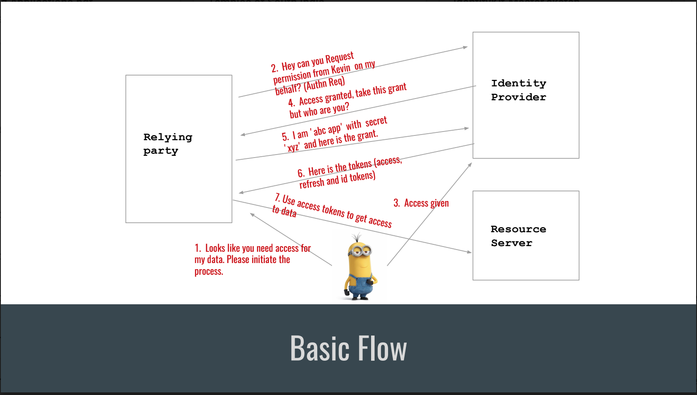

# OpenID connect JVM client

OpenId Connect Client written in Kotlin.

# OpenID in a nutshell

A Gist of [OpenID Connect](securingApplications.pdf)

This client is implemented with reference to [OpenID Connect Basic Client Implementer's Guide](https://openid.net/specs/openid-connect-basic-1_0.html)

# OpenID connect Basic Flow




# How to use the library

## Kotlin

- Step 1:  Load Client Configuration

```kotlin
 ClientConfiguration.
               .with()
               .client("<your-client-id>",
               "<your-redirect-uri>",
               "<your-secret>")
               .issuer("<issuer-url>")

```

- Step 2: Make an Authentication Request

```kotlin
AuthenticationRequestBuilder()
                        .basic()
                        .build()
                        .andRedirect(response);
```

- Step 3: Exchange Code for access token and id token

```kotlin
val user = OpenIdConnectCallBackInterceptor(httpServletRequest)
                .extractCode()
                .exchangeCodeForTokens()
                .extractAuthenticatedUserInfo();
```

## Java

- Step 1:  Load Client Configuration

```java
 ClientConfiguration.INSTANCE
               .with()
               .client("<your-client-id>",
               "<your-redirect-uri>",
               "<your-secret>")
               .issuer("<issuer-url>")

```

- Step 2: Make an Authentication Request

```java
new AuthenticationRequestBuilder()
                        .basic()
                        .build()
                        .andRedirect(response);
```

- Step 3: Exchange Code for access token and id token

```java
AuthenticatedUser user = new OpenIdConnectCallBackInterceptor(httpServletRequest)
                .extractCode(null)
                .exchangeCodeForTokens()
                .extractAuthenticatedUserInfo(null);
```

# References
1. [OpenID Connect Specification](https://openid.net/specs/openid-connect-core-1_0.html)
2. [OpenID connect playground](https://openidconnect.net/)
3. [JWT](https://jwt.io/)
